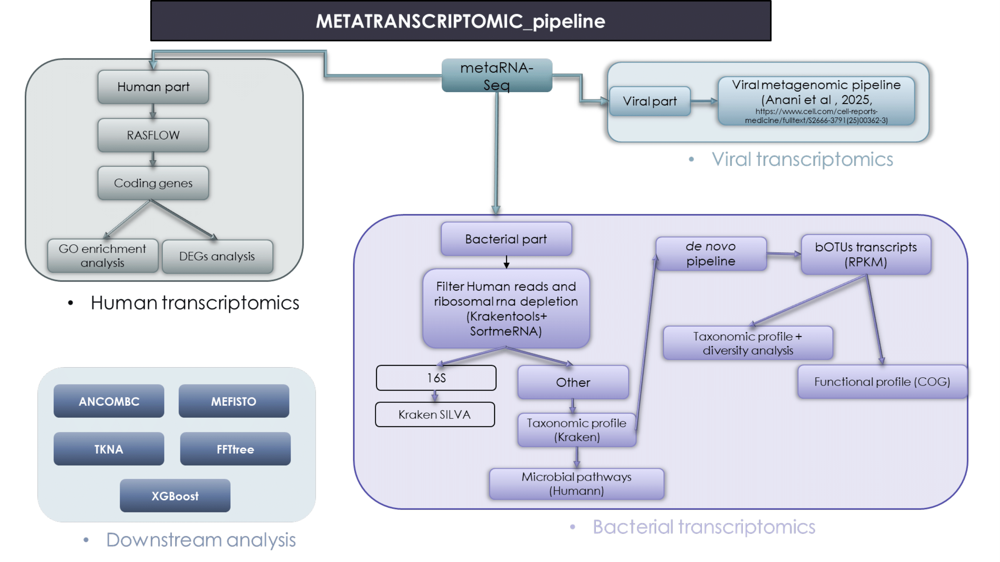

# HAP2-PREVHAP-HAP_pneumotypes

All codes for: Anani et al. Identification of pneumotypes associated with inflammation and all-cause mortality following HAP in critically ill patients.

## Metatranscriptomics Pipeline




Reproducibility and Installation Guide
This repository contains the computational workflows, statistical analyses, and visualization scripts used in the manuscript describing bacterial-viral pneumotypes associated with hospital-acquired pneumonia (HAP).
________________________________________
## System Requirements

Recommended resources:
•	≥16 GB RAM
•	≥100 GB storage for metagenomic analyses
•	multicore CPU environment recommended
________________________________________
## Software Dependencies
#Core Requirements
Install the following software before running analyses.

| Software        | Version Tested |
|----------------|----------------|
| R              | >= 4.2         |
| Python         | >= 3.10        |
| Conda / Mamba  | latest         |
| Git            | latest         |
| Bash           | >= 4           |
________________________________________

## Bioinformatics Pipelines
The RASFLOW pipeline (https://link.springer.com/article/10.1186/s12859-020-3433-x) was used to analyze human transcriptomic data and infer a count matrix of human coding genes. The input is trimmed sequencing reads in FASTQ format, and the output is a matrix mapping all sample reads to coding human genes. The output matrix is provided in the data folder.

## Bioinformatics Tools
The following external tools are used throughout the workflow.

| Tool        | Purpose |
|-------------|---------|
| FastQC      | Sequencing quality control |
| fastp       | Read trimming and filtering |
| Kraken2     | Read taxonomic classification |
| KrakenTools | Taxonomic extraction and report processing |
| SPAdes      | Metagenomic assembly |
| CD-HIT      | Sequence dereplication and clustering |
| Diamond     | Protein alignment |
| PhaBOX2     | Viral prediction and viral sequence identification |
| SortMeRNA   | Ribosomal RNA removal |
| HUMAnN      | Bacterial metabolic pathway prediction |
| TkNA        | In silico causality inference and transkingdom network analysis |
| BWA         | Read mapping to contigs |
| Samtools    | BAM/SAM processing |
| Cytoscape   | Network visualization |

________________________________________

## Installation Instructions for Bioinformatics Tools

The workflow relies on several bioinformatics tools that can be installed using Conda/Mamba.  

---

### Install Miniconda

```bash
wget https://repo.anaconda.com/miniconda/Miniconda3-latest-Linux-x86_64.sh

bash Miniconda3-latest-Linux-x86_64.sh

Create Workflow Environment
conda create -n hap2_env python=3.10 -y
conda activate hap2_env
Install Bioinformatics Tools
conda install -c bioconda -c conda-forge \
    fastqc \
    fastp \
    kraken2 \
    krakentools \
    spades \
    cd-hit \
    diamond \
    sortmerna \
    bwa \
    samtools \
    humann
	
``` 

# Install PhaBOX2

PhaBOX2 can be installed via pip:

pip install phabox2

Alternatively:

git clone https://github.com/KennthShang/PhaBOX.git
cd PhaBOX
pip install -r requirements.txt

# Install TkNA

Installation instructions are available at:
https://github.com/CAnBioNet/TkNA

Example installation:

git clone https://github.com/CAnBioNet/TkNA.git
cd TkNA
pip install -r requirements.txt

# Install Cytoscape

Cytoscape installation instructions (Windows/Linux/macOS):
https://cytoscape.org/download.html

# R Package Installation

#CRAN Packages
install.packages(c(
  "tidyverse",
  "data.table",
  "ggplot2",
  "dplyr",
  "tidyr",
  "pheatmap",
  "ComplexHeatmap",
  "vegan",
  "survival",
  "survminer",
  "caret",
  "randomForest",
  "xgboost",
  "igraph",
  "reshape2",
  "patchwork",
  "cowplot",
  "readr",
  "stringr",
  "RColorBrewer",
  "ROCR",
  "pROC"
))

# Bioconductor Packages

if (!require("BiocManager"))
    install.packages("BiocManager")

BiocManager::install(c(
  "DESeq2",
  "phyloseq",
  "edgeR",
  "limma",
  "SIAMCAT"
))
Optional Packages
install.packages(c(
  "FFTrees",
  "reticulate"
))

# Python Package Installation

If using pip instead of conda:

pip install pandas numpy scipy scikit-learn matplotlib seaborn networkx jupyter

# Configuration

# Example Configuration File

RASFLOW config file is located in the configs folder:

config/config_main.yaml


________________________________________
## Input Data Formats
Metadata Table (example in the metadata folder)
Tab-separated file.
Required columns:
| Column name  | Description |
|--------------|-------------|
| sample_id    | Unique sample identifier |
| patient_id   | Unique patient identifier |
| condition    | Clinical grouping |
| timepoint    | Sampling time |
| outcome      | Clinical outcome |

Example:

| sample_id | patient_id | condition | cluster |
|----------|------------|-----------|----------|
| S01      | P001       | HAP       | Low risk |
| S02      | P002       | Control   | High risk |
________________________________________

## Taxonomic Abundance Matrix (Example)

Rows correspond to taxa, and columns correspond to samples.

| Taxon               | S01 | S02 | S03 |
|--------------------|-----|-----|-----|
| Prevotella corporis | 10  | 2   | 4   |
| Veillonella sp.     | 0   | 8   | 3   |
________________________________________
FASTQ Input (example in the data folder)
Paired-end FASTQ format:
sample_1_R1.fastq.gz
sample_1_R2.fastq.gz
________________________________________
## Workflow Overview
This pipeline performs end-to-end metagenomic/metatranscriptomic processing, including quality control, host read removal, taxonomic profiling, de novo assembly, contig dereplication, and bacterial/viral identification.
________________________________________
# Workflow Overview

---

## Step 1: Sample Preparation and Interleaving

### Description
Paired-end FASTQ files are detected automatically and converted into interleaved FASTQ format for downstream processing.

### Tools
- BBTools (`reformat.sh`)

### Inputs
- Raw paired-end FASTQ files (`*_R1.fastq.gz`, `*_R2.fastq.gz`)

### Outputs
- Interleaved FASTQ files

### Main Operations
- Automatic sample detection  
- Generation of sample list  
- Read interleaving  

---

## Step 2: Read Trimming and Quality Control

### Description
Sequencing adapters, low-quality bases, and low-complexity reads are removed using `fastp`. QC reports are generated for each sample.

### Tools
- fastp
- jq

### Outputs
- Trimmed FASTQ files  
- HTML QC reports  
- JSON QC reports  
- Global QC summary table  

### Main Filtering Parameters
- Minimum read length: 30 bp  
- Quality threshold: Q17  
- Low complexity filtering enabled  
- Adapter trimming enabled  

### Generated Reports
- Per-sample fastp reports  
- `fastp_summary.tsv`

---

## Step 3: Host Read Removal (Dehosting)

### Description
Human-derived reads are removed to retain only microbial sequences.

### Tools
- SRA Human Scrubber  
- BBTools (`repair.sh`)  
- pigz / unpigz  

### Outputs
- Dehosted FASTQ files  

### Main Operations
- Human read filtering  
- Read repair after filtering  
- Compression of cleaned reads  

---

## Step 4: Taxonomic Classification

### Description
Reads are reformatted back into paired-end format and classified taxonomically using Kraken2.

### Tools
- Kraken2  
- BBTools (`reformat.sh`)

### Outputs
- Kraken2 reports  
- Classified read files  
- Taxonomic abundance tables  

### Main Parameters
- Confidence threshold: 0.1  
- Minimum hit groups: 2  

---

## Step 5: Removal of Eukaryotic Reads

### Description
Eukaryotic reads are removed from classified datasets to enrich microbial and viral fractions.

### Tools
- KrakenTools (`extract_kraken_reads.py`)

### Outputs
- Filtered paired FASTQ files  

### Main Operations
- Extraction of non-eukaryotic reads  
- Filtering using NCBI taxonomy identifiers  

---

## Step 6: Taxonomic Table Construction

### Description
Kraken2 outputs are converted into lineage-based abundance tables and merged into a global abundance matrix.

### Tools
- awk  
- join  

### Outputs
- Per-sample taxonomic tables  
- Global abundance matrix (`meta.tsv`)  

### Main Operations
- Taxonomic lineage annotation  
- Table sorting and merging  

---

## Step 7: De Novo Metagenomic Assembly

### Description
Metagenomic assembly is performed independently for each sample using metaSPAdes.

### Tools
- SPAdes (`spades.py`)

### Outputs
- Sample-specific assembly directories  
- Contig FASTA files  

### Main Parameters
- `--meta` mode enabled for metagenomic data  
- `--rna` mode for metatranscriptomic data  
- Multithreaded execution  

---

## Step 8: Contig Dereplication

### Description
All assembled contigs are pooled, filtered by length, and dereplicated to generate a non-redundant contig catalog.

### Tools
- CD-HIT-EST  
- BBTools (`reformat.sh`)

### Outputs
- Filtered contigs  
- Dereplicated contig catalog  

### Main Parameters
- Minimum contig length: 500 bp (viruses), 1000 bp (bacteria)  
- Clustering identity threshold: 95%  

---

## Step 9: Viral Identification and Annotation

### Description
Viral contigs are identified using PhaBOX2.

### Tools
- PhaBOX2  
- Conda environment  

### Outputs
- Viral prediction results  
- Viral annotation files  
- End-to-end viral analysis reports  

### Main Parameters
- Minimum contig length: 500 bp  
- Multithreaded execution  

---

## Step 10: Bacterial Contig Identification

### Description
Dereplicated contigs are screened against a bacterial reference database using DIAMOND BLASTX to identify bacterial contigs and extract bacteria-associated sequences for downstream analyses.

### Tools
- DIAMOND  
- awk  
- grep  
- join  

### Inputs
- Dereplicated contig catalog (`allcontigs_filtered_100_dereplicated.fasta`)  
- DIAMOND bacterial reference database  
- NCBI taxonomy lineage table  

### Outputs
- DIAMOND alignment results  
- Bacterial contig annotation table (`bacterial_contigs.tsv`)  
- Bacterial contig list (`bacterial_contigs_list.txt`)  
- Bacterial FASTA file (`all_bacterial_contigs.fasta`)  

### Main Operations
- DIAMOND BLASTX alignment against bacterial proteins  
- Lowest Common Ancestor (LCA) taxonomic assignment  
- Extraction of bacterial contigs  
- Reconstruction of bacterial-only FASTA dataset  

### Main Parameters
- E-value threshold: 1e-3  
- Taxonomic restriction: Bacteria (taxon ID 2)  
- Multithreaded execution  

---

## Step 11: RASflow RNA-seq Analysis Pipeline

### Description
RNA-seq data can be processed using RASflow to perform standardized transcriptomic analysis, including QC, alignment/quantification, and differential expression analysis. This complements metagenomic results with host or functional transcriptomics.

Based on:
- RASflow (Snakemake RNA-seq workflow)

### Tools
- Snakemake  
- Conda  
- FastQC  
- HISAT2  
- featureCounts  

### Inputs
- Paired-end or single-end FASTQ files  
- Sample metadata table  
- Reference genome or transcriptome  

### Outputs
- BAM alignment files or quantification matrices  
- Gene/transcript count tables  
- MultiQC reports  

### Main Operations
- Read alignment  
- Gene/transcript quantification  

### Main Parameters
- Configured via `config_main.yaml`  
- Supports genome or transcriptome mode  
- Supports paired and single-end data  
- Fully modular Snakemake pipeline  

## Reproducibility
All analyses are executed using Singularity containers to ensure computational reproducibility and portability across computing environments.
All Singularity image files (.sif) used in this workflow are available directly in the Git repository to facilitate full reproducibility of the analysis (images_singularity folder).


## Mapping Scripts to Manuscript Figures

| Manuscript Figure                     | Script                         |
|--------------------------------------|--------------------------------|
| Figure 1                             | Powerpoint                     |
| Figure 2                             | scripts/figure2.R              |
| Figure 3                             | scripts/figure3.R              |
| Figure 4                             | scripts/figure4.R              |
| Figure 5                             | scripts/figure5.R              |
| Figure 6                             | scripts/figure6.R              |
| Supplementary/extended Figures       | scripts/Additional_scripts.R   |
